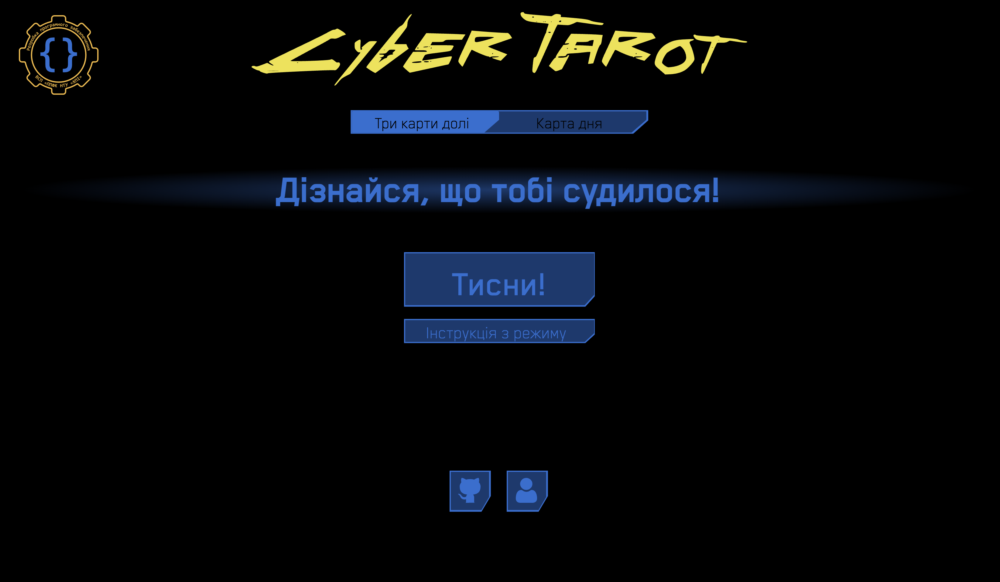
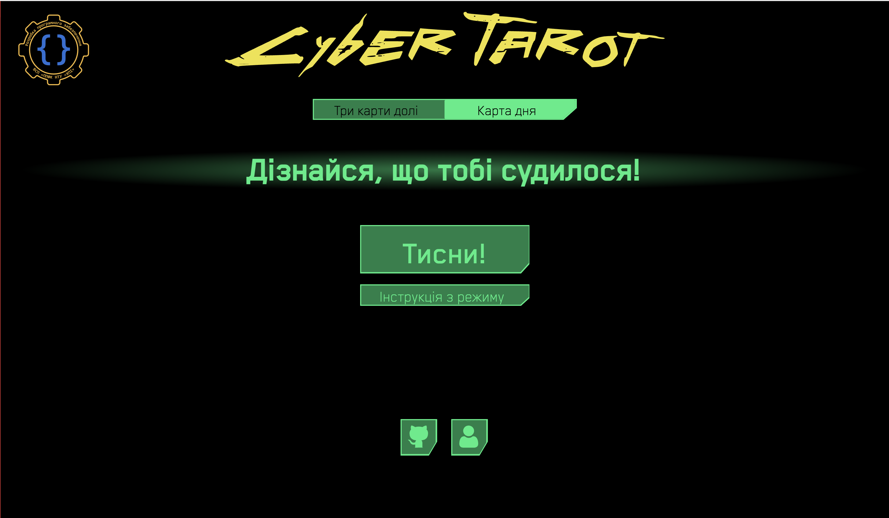
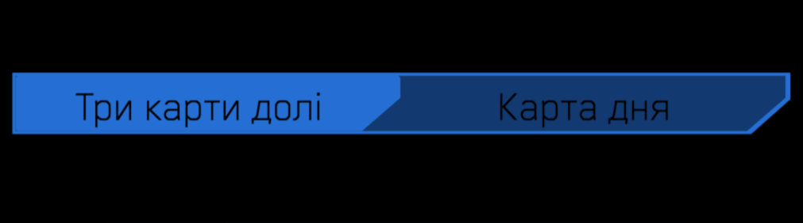
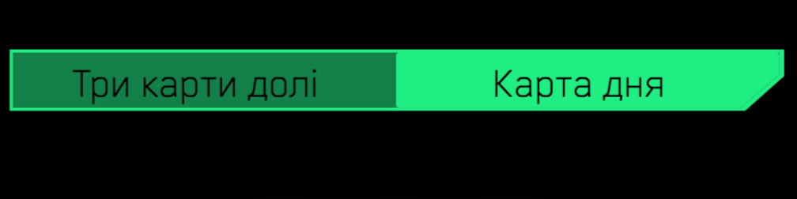
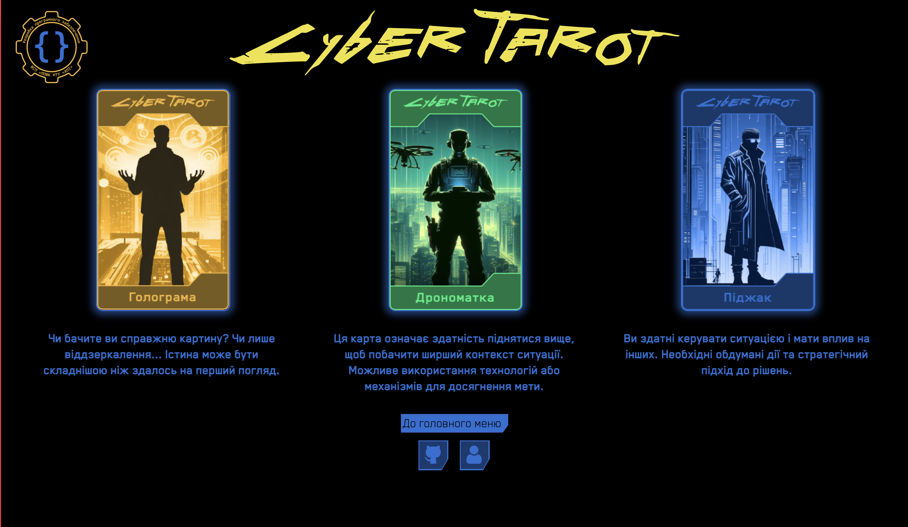
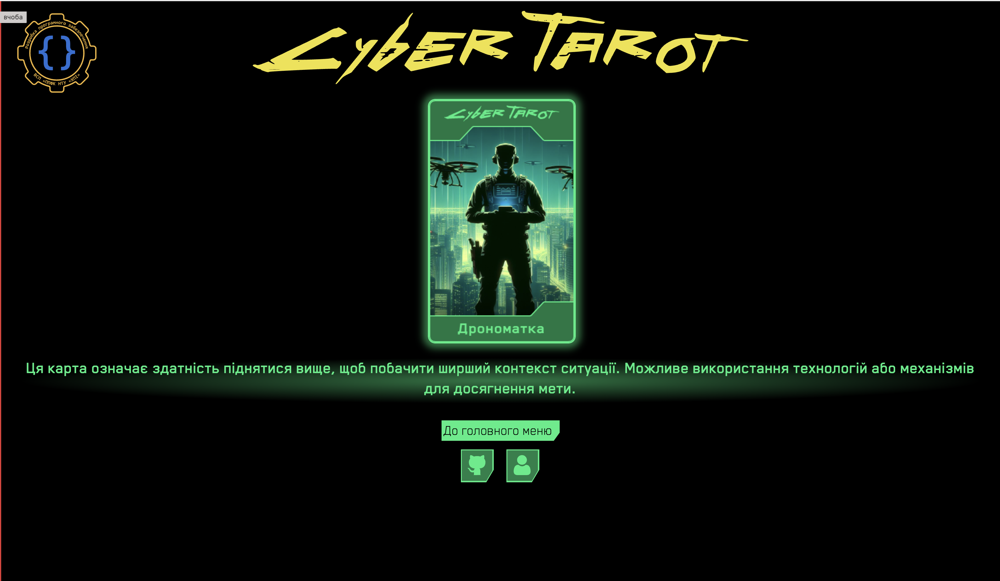
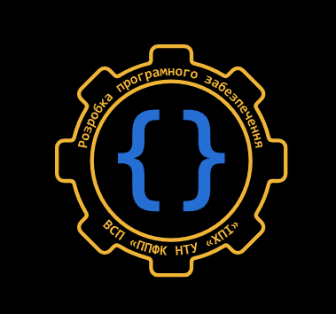

# Довідка з використання

## Головне меню

В головному меню присутні елементи керування, такі як:
- Слайдер перемикання режимів
- Кнопка для отримання карт/карти (версія на ПК)
- Кнопка для відкриття інструкції до режиму
- Кнопка-посилання на GitHub репозиторій програми
- Кнопка переходу на сторінку авторів

### Слайдер перемикання режимів

Дозволяє користувачу перемикатися між режимом "Три карти долі" і режимом "Карта дня". Перемикання здійснюється методом натискання на заголовок режиму, і якщо користувач знаходиться в протилежному режимі, то відбувається перехід.

### Кнопка для отримання карт/карти (версія на ПК)

Найбільша кнопка меню з написом "Тисни!". Після натискання виконує головну функцію застосунку та видає результат у вигляді карт Таро, їх може бути одна або три в залежності від режиму.

### Кнопка для відкриття інструкції до режиму

Після натискання відкриває сторінку з поясненням особливостей режиму та інструкцією дій.

### Кнопка-посилання на GitHub репозиторій програми

Після натискання переводить користувача на сторінку сервісу GitHub з репозиторієм продукту.

### Кнопка переходу на сторінку авторів

При натисканні відкриває сторінку з іменами авторів застосунку та їхніми ролями.

## Режим "Три карти долі"

Режим викидання трьох карт Таро з інформацією про минуле, сьогодення та майбутнє відповідно, після натискання кнопки отримання карт (ПК), або трясіння телефону. Після отримання карт можна повернутися до головного меню натиснувши відповідну кнопку знизу.

## Режим "Карта дня"

Режим викидання однієї карти Таро з інформацією про сьогоднішній день, після натискання кнопки отримання карти (ПК), або трясіння телефону. Після отримання карт можна повернутися до головного меню натиснувши відповідну кнопку знизу.

## Перехід на сторінку спеціальності "Розробка програмного забезпечення"

У головному меню, у верхньому лівому кутку, присутній логотип спеціальності "Розробка програмного забезпечення" Відокремленого структурного підрозділу "Полтавський політехнічний фаховий коледж національного технічного університету "Харківський політехнічний інститут", при натисканні на який відкривається сторінка відповідної спеціальності з інформацією для абітурієнтів.
